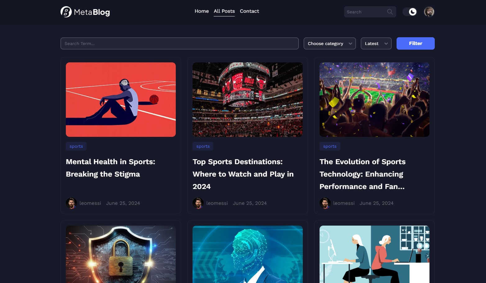

<div style="display:flex; align-items: center">
  <h1 style="position:relative; top: -6px" >META Blog</h1>
</div>

---

### Screenshot



The project is a blogging platform with two roles: Admin and User.

Users can register, log in, post content, and manage their posts on a personal dashboard. They can also comment, like, edit, and delete their own comments.

Admins have full access to all content and user information, allowing them to manage and edit or delete any post or comment.

Unauthorized users will be redirected to the login page. The site will support dark/light modes and Google authentication.

#

### Table of Contents

- [Prerequisites](#prerequisites)
- [Tech Stack](#tech-stack)
- [Getting Started](#getting-started)

### Prerequisites

- _Node JS @22.X and up_
- _npm @10 and up_

#

### Tech Stack

- [React @18.2.0] - Front-end framework
- [Typescript] - JavaScript with syntax for types
- [@tanstack/react-query] - Powerful asynchronous state management for TS/JS.
- [Tailwind CSS @3.4.2] - CSS framework
- [React Hook Form @7.51.3] - library for form validation

- [Node.js / Express.js] - Back-end
- [MongoDB, mongoose] - Database

#

### Getting Started

1\. First of all you need to clone repository from github:

```sh
git clone https://github.com/datomaluta/mern-blog.git
```

2\. Install all the dependencies

```sh
npm install
```

3\. after that you can run application from terminal:

```sh
npm run dev
```

4\. Next, go to app client directory with this command

```sh
cd client
```

5\. Next step requires install all the dependencies again

```sh
npm install
```

6\. after that you can run application from terminal:

```sh
npm run dev
```

#
